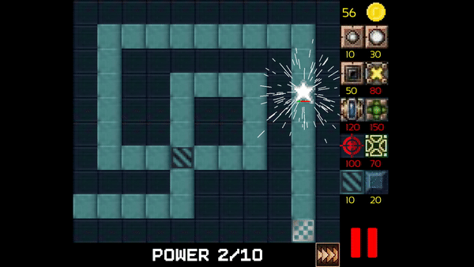

# Tower-Defense
Developed using C++ and SFML.

# Description:
* 6 different levels. 
* Shooting towers, support towers, slowing and stopping zones. 
* Buttons to pause and change speed of the game. 

# Gameplay:
https://youtu.be/k8cjqXH8L4s

# Screenshots:

